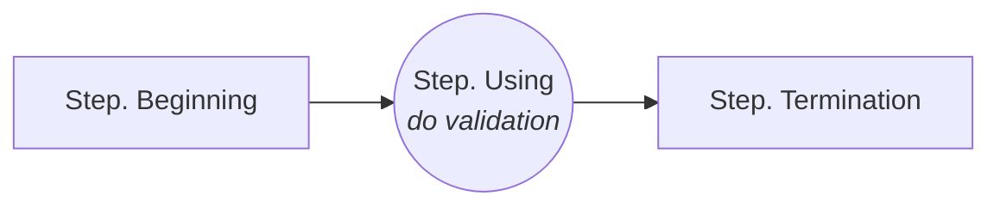
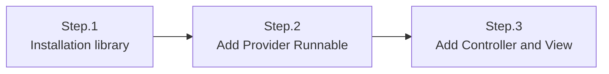

# Usage of Server-side KnownUser SDK for ASP .NET Core

The *`Server-side KnownUser SDK`* are used to ensure that end users cannot bypass the queue by adding a server-side integration to your web server.
Before getting started please read the documentation to get acquainted with [*Server-side KnownUser SDK*](server-side_knownuser.md).

The recommended method for WEB services is [Using Simple Redirects](#example-tomcat--servlet--using-simple-redirects).

# Prerequisites
- Server-side KnownUser SDK for ASP .NET Core
- ASP .NET Core >= 3.1 

# Basic flow and class for usage
<p ailgn="center"></p>

# Implementation

A decryption key is needed to verify that `Token` is correct. Basically, it provides a way to check directly using decryption key(`<secret key>`). 
<br>However, it is recommended to use the `Method(Provider & Runnable)` to respond if the decryption key(`<secret key>`) changes or the *`Waiting Room Server`* shuts down.

# Method: Basic

Basically, it's a way to check directly using the decryption key(`<secret key>`).

key class & method:
```C#
namespace coat9.knownuser;
public class Token
{
    /// <summary>
    /// do validation of 'token string'.
    /// </summary>
    /// <param name="domain">ticket issued domain. - if null or empty, do not check.</param>
    /// <param name="vwrid"> ticket issued vwrid(virtual waiting room ID). 
    ///                      - if null or empty, do not check.
    /// </param>
    /// <param name="secretKey">decryption key string with a string length of 24 digits.</param>
    /// <param name="appendExpireTime">extend the set expire time by seconds. 
    ///                                 - if less than 0, no expire time check.
    /// </param>
    /// <param name="tokenString">token string.</param>
    /// <returns>bool. true:valid token, false:invalid token</returns>
    /// <see cref="Token#setToken(string)"/>

    public static bool doValidation(string domain, string vwrid, string secretKey, long appendExpireTime, string tokenString);
    public static bool doValidation(string domain, string vwrid, string secretKey, string tokenString);
}
```
The reason why the set expiration time is extended in seconds(`appendExpireTime`) is to correct the network delay of the user and the time error between the *`Waiting Room Server`*.


example:
```C#
// Token Validation
bool result = coat9.knownuser.Token.doValidation("<domain>","<vwrid>","<secret key>","<token string>");
```

# Method: Cached Config
Using `<secret key>` every time a token is checked can be cumbersome and error-prone as all `<secret key>` must be modified if `<secret key>` is changed. To improve this, `<secret key>` is stored in `Config` and cached and used.


```C#
coat9.knownuser.Config config =  coat9.knownuser.Config.getCached();
config.setDomain("coat9.com");            // <domain>
config.setSecretKey("0123456789012345");  // <secret key>
config.setAppendExpireTime(60);           // extend the set expire time by seconds.

// do validation of 'token string'
bool result = coat9.knownuser.Token.doValidation("<vwrid>","<token string>");
```

# Method: Provider
To import `<secret key>` from the *`Waiting Room Server`*, the access URL and the `<domain>` and `<openapi key>`(authentication key) of the service are required.
<br>Use *`Microsoft.AspNetCore.Http`* when requesting to *`Waiting Room Server`*. 

key class & method:
```C#
namespace coat9.knownuser;
public class Token
{

    /// <summary>
    /// do validation of 'token string'.
    /// Use cached <cref="Config">configuration</cref> variables.
    /// </summary>
    /// <param name="vwrid"> ticket issued vwrid(virtual waiting room ID). 
    ///                      - if null or empty, do not check.
    /// </param>
    /// <param name="tokenString">token string.</param>
    /// <returns>bool. true:valid token, false:invalid token</returns>
    /// <see cref="Token#doValidation(string,string,Token)"/>

    public static bool doValidation(string vwrid, string tokenString);
}
```

example:
```C#
coat9.knownuser.Provider provider = coat9.knownuser.Provider.getCached();
coat9.knownuser.Config config =  provider.getConfig();

config.setDomain("coat9.com");                      // <domain>
config.setAppendExpireTime(60);                     // extend the set expire time by seconds.
provider.setAPIUrl("http://demo.coat9.com/openapi");// `Waiting Room Server` url
provider.setAPIKey("<openapi key>");                // <openapi key> : access authentication key

try{
    // get `<secret key>` from `Waiting Room Server`
    provider.refresh();
}catch(coat9.knownuser.InvalidException ex) {
    Console.WriteLine("result:" + ex);
    return;
}

// do validation of 'token string'
bool result = coat9.knownuser.Token.doValidation("<vwrid>","<token string>");
```

# Method: Provider local config file

If the network environment does not allow access to the 'Waiting Room Server', this method is used by storing config-related information in a file on the system.<br>
Please refer to [*Result in Text format*](server-side_knownuser.md#result-in-text-format) for the writing format. However, code/mesg/size is not necessary.

example:
```C#
coat9.knownuser.Provider provider = coat9.knownuser.Provider.getCached();
coat9.knownuser.Config config =  provider.getConfig();

config.setDomain("coat9.com");                      // <domain>
config.setAppendExpireTime(60);                     // extend the set expire time by seconds.
provider.setLocalConfigFile("<file path>");         // local config file.

try{
    // get `<secret key>` from `Waiting Room Server`
    provider.refresh();
}catch(coat9.knownuser.InvalidException ex) {
    Console.WriteLine("result:" + ex);
    return;
}

// do validation of 'token string'
bool result = coat9.knownuser.Token.doValidation("<vwrid>","<token string>");
```


# Method: Provider Runnable
In order to properly use [Method: Provider](#method-provider) in real services, you must periodically request *`Waiting Room Server`* to update `<secret key>`.

## Rules in case of exceptions
- If `Waiting Room Server` is in shutdown state, it is processed valid(bypass).
- User may not have Token when `Waiting Room Server` operates normally after shutdown. It provides a grace time for this and passes valid(bypass).
- When the response information from `Waiting Room Server` is incorrect, it is processed valid(bypass).


# Method: Provider Runnable for app



The example is described as `[Beginning]/[Using]/[Termination]`, but when implemented in practice, each part should be used appropriately.

example:
```C#
public class KnownuserService : IHostedService, IDisposable
{
    private Timer _timer;

    /*
     * [Benning] Add to application beginning.
     */
    public Task StartAsync(CancellationToken cancellationToken)
    {
        coat9.knownuser.Provider provider = coat9.knownuser.Provider.getCached();
        coat9.knownuser.Config config =  provider.getConfig();
        
        
        
        config.setDomain("coat9.com");   // <domain>
        config.setAppendExpireTime(60);  // extend the set expire time by seconds.
        config.setTokenGraceTime(60);    // grace time for empty token after an error occurs.
        provider.setAPIUrl("http://demo.coat9.com/openapi");  // `Waiting Room Server` url
        provider.setAPIKey("<openapi key>");  // <openapi key> : access authentication key

        _timer = new Timer(DoWork, null, TimeSpan.Zero, TimeSpan.FromSeconds(10));

        return Task.CompletedTask;
    }

    /*
     * [Using] Add where you need to check.
     */
    private void DoWork(object state)
    {
        bool result = coat9.knownuser.Token.doValidation("<vwrid>","<token string>");
    }

    public Task StopAsync(CancellationToken cancellationToken)
    {
        _timer?.Change(Timeout.Infinite, 0);
        return Task.CompletedTask;
    }

    /*
     * [Termination] Add to application termination.
     */
    public void Dispose()
    {
        _timer?.Dispose();
    }
}
```
---

# Method: Provider Runnable for IIS



## Example development environment
 * .NET Core 3.1
 * [IIS 10](https://learn.microsoft.com/ko-kr/iis/get-started/whats-new-in-iis-10/new-features-introduced-in-iis-10)


## Step.1 Installation library
add `Server-side Known User SDK` files to the installed IIS's lib.
<br>(Json library is not needed in the current version)
```ASN.1
<installed .NET Core webapps path>
  ....
  +── root               
  │    ├── css   
  |    |── js
  │    └── lib               
  │         ├── coat9.knownuser.v1.dll - Server-side KnownUser SDK library
  │         └── json-20230227.jar      - Json library ← not required for current version
```

## Step.2 Add Provider Runnable 

Implement `[Beginning]/[Termination]` of `Provider Runnable` using *`IHostedService, IDisposable`*.
```C#
namespace coat9.knownuser;
using Microsoft.Extensions.Hosting;
using System;
using System.Threading;
using System.Threading.Tasks;

public class KnownuserService : IHostedService, IDisposable
{
    private Timer _timer;

    /*
     * [Benning] Add to application beginning.
     */
    public Task StartAsync(CancellationToken cancellationToken)
    {
        coat9.knownuser.Provider provider = coat9.knownuser.Provider.getCached();
        coat9.knownuser.Config config =  provider.getConfig();
        
        config.setDomain("coat9.com");   // <domain>
        config.setAppendExpireTime(60);  // extend the set expire time by seconds.
        config.setTokenGraceTime(60);    // grace time for empty token after an error occurs.
        provider.setAPIUrl("http://demo.coat9.com/openapi");  // `Waiting Room Server` url
        provider.setAPIKey("<openapi key>");  // <openapi key> : access authentication key

        _timer = new Timer(DoWork, null, TimeSpan.Zero, TimeSpan.FromSeconds(10));

        return Task.CompletedTask;
    }

    /*
     * [Using] Add where you need to check.
     */
    private void DoWork(object state)
    {
        bool result = coat9.knownuser.Token.doValidation("<vwrid>","<token string>");
    }

    public Task StopAsync(CancellationToken cancellationToken)
    {
        _timer?.Change(Timeout.Infinite, 0);
        return Task.CompletedTask;
    }

    /*
     * [Termination] Add to application termination.
     */
    public void Dispose()
    {
        _timer?.Dispose();
    }
}
```

add `IHostedService`(coat9.KnownuserService) and `doValidation`(coat9.KnownuserWeb.doValidation) to `Startup.cs`(the entry point of the application).

```C#
using Microsoft.Extensions.DependencyInjection;
using Microsoft.Extensions.Hosting;

public class Startup
{
    // ...

    public void ConfigureServices(IServiceCollection services)
    {
        // Add KnownuserService here as Singleton.
        services.AddSingleton<IHostedService, KnownuserService>();
    }

    public void Configure(IApplicationBuilder app, IWebHostEnvironment env)
    {
        //...

        app.Use(async (context, next) => {
			Task<bool> ret = KnownuserWeb.doValidation(context);
			if (await ret)
			{
				await next.Invoke();
			}
		});
		// app.UseMvc();     //Preversion code.
		// 2. It is automatically activated for use in session middleware.
		// app.UseSession();

        //...
    }
}
```


## Step.3 Add Controller and View

The operation method is basically the same as [Method: Provider Runnable for Tomcat(Servlet)](method-provider-runnable-for-tomcatservlet).
 However, it is a method designed to be convenient to use in general web and provides the `knownUser.dll` library.
You can refer to the `Servlet.WEB` library and make it suitable for each service.

- `knownUser.dll` is [here](archive/coat9.knownuser.v1.servlet.web.java).

## Redirect parameter
<center></center>

`URL encode` is equivalent to encodeURIComponent, see [here](https://developer.mozilla.org/en-US/docs/Web/JavaScript/Reference/Global_Objects/encodeURIComponent).


key class & method:
```C#
namespace coat9.test;
public class web {

    /// <summary>
    /// Sample: do HTTP redirect.
    /// </summary>
    /// <param name="context">  HttpContext.</param>
    /// <param name="url">redirect URL string.</param>
    /// <remarks>
    /// ----------------------------------------------------------------------
    /// This method developer must adjust it to suit the service environment.
    /// ----------------------------------------------------------------------
    /// </remarks>
    public static void doSampleRedirect(HttpContext context, String url)
    {
        context.Response.Headers.Add("Expires", "Fri, 01 Jan 1990 00:00:00 GMT");
        context.Response.Headers.Add("Cache-Control", "no-store, no-cache, must-revalidate, max-age=0");
        context.Response.Headers.Add("Pragma", "no-cache");
        context.Response.Redirect(url);
        return;
    }

    /// <summary>
    /// Sample: Adds a message to the error page URL for HTTP Redirect.
    ///         format: <error url> + [?|&]errno=x + &emesg=..
    /// </summary>
    /// <param name="context">HttpContext.</param>
    /// <param name="knownuser">coat9's web library.</param>
    /// <param name="eno">Error number.
    /// -1: Invalid config.
    ///  2: Prevent retry.
    ///  3: Validation token.
    ///  4: Does not match the path of the token.
    ///  5: Does not match the uaid(user authentication ID) of the token.</param>
    /// <param name="mesg">Error message string.</param>
    /// <seealso cref="doSampleRedirect(HttpContext, String)"/>
    /// <remarks>
    /// ----------------------------------------------------------------------
    /// This method developer must adjust it to suit the service environment.
    /// ----------------------------------------------------------------------
    /// </remarks>
    public static void doSampleErrorMessage(HttpContext context, KnownuserWeb knownuser, int errno, String mesg)
    {
        String path = knownuser.ErrorURL();
        if (string.IsNullOrEmpty(path))
            path = "error.html";
        doSampleRedirect(context, "" + path + (path.IndexOf('?') < 0 ? "?" : "&") + "eno=" + errno + "&emesg=" + encodeURIComponent(mesg));
    }

    /// <summary>
    /// Sample: Performs validation.
    ///         depending on the result, if waiting is necessary, `HTTP Redirect` is performed to the `waiting page`,
    ///         and if an error occurs, `HTTP Redirect` is performed to the `error page`.
    /// </summary>
    /// <param name="context">HTTP Servlet Response.</param>
    /// <returns>True - allow us to provide services. False - Result was processed with `HTTP Redirect`.</returns>
    /// <seealso cref="coat9.test.web#doValidation()"/>
    /// <seealso cref="doSampleRedirect(HttpContext, String)"/>
    /// <seealso cref="doSampleErrorMessage(HttpContext, KnownuserWeb, int, String)"/>
    /// <remarks>
    /// ----------------------------------------------------------------------
    /// This method developer must adjust it to suit the service environment.
    /// ----------------------------------------------------------------------
    /// </remarks>
    public static bool doSampleValidation(HttpContext context)
    {
        KnownuserWeb knownuser= new  KnownuserWeb(context);
        //knownuser.setUAID(context.Session.Id);
        knownuser.setErrorURL("/redirect/error.html");
        knownuser.setFixedWaitingURL("/redirect/waiting.html");

        knownuser.setWithCookie(WithRedirect.Included);
        knownuser.setWithBody(WithRedirect.Included);

        try
        {
            Result validation_result = knownuser.doValidation();
            if (validation_result == Result.Redirect)
            {
                if (string.IsNullOrEmpty(knownuser.RedirectURL()))
                    doSampleErrorMessage(context, knownuser, -1, "This is a case where there is no redirection URL");
                else
                    doSampleRedirect(context, knownuser.RedirectURL());
                return (false);
            } else if (validation_result ==Result.ErrorPreventRetry) {
                doSampleErrorMessage(context, knownuser, 2, "prevent retry."); return (false);
            } else if (validation_result == Result.ErrorValidationToken) {
                doSampleErrorMessage(context, knownuser, 3, "verification token."); return (false);
            } else if (validation_result == Result.ErrorMatchPath) {
                doSampleErrorMessage(context, knownuser, 4, "does not match the path of the token."); return (false);
            } else if (validation_result == Result.ErrorMatchUaid) {
                doSampleErrorMessage(context, knownuser, 5, "not match the uaid(user authentication ID) of the token."); return (false);
            }
        } catch (Exception) { }
        return (true);
    }   

    /// <summary>
    /// Sample: ........................
    /// </summary>
    /// <param name="context">HTTP Servlet Response.</param>
    /// <remarks>
    /// ----------------------------------------------------------------------
    /// This method developer must adjust it to suit the service environment.
    /// ----------------------------------------------------------------------
    /// </remarks>
    public static async Task<bool> doValidation(HttpContext context)
    {
        // Check if enabled knownuser
        if (getPathExtension(context.Request.Path).Length > 0)
            return (true);
        Console.WriteLine("" + context.Request.Path);
        if (!doSampleValidation(context))
        {
            // await context.Response.WriteAsync($"Request Short Circuited");
            return (false);
        }
        return (true);
    }

}
```

example controller:
```C#
public class HomeController : Controller
{
    // ...

	public IActionResult Redirect()
	{
        //add a model to get HttpContext.
		var model = new KnownuserModel();

		model.context = HttpContext.Request.HttpContext;

		HttpContext context = model.context;

		return View(context);
	}

	// ...
}

```

example view:
```jsp
@using coat9.knownuser;
@using knownuser.v1.aspnetcore.testmvc.Models;
@model KnownuserModel;
@{
	KnownuserWeb knownuser1 = new knownuser.v1.aspnetcore.testmvc.KnownuserWeb(Model.context);
	//knownuser.setUAID(knownuser.v1.aspnetcore.testmvc.KnownuserWeb.getCookie(Model.context, "JSESSIONID"));
	knownuser1.setErrorURL("<path>/error.html");
	//knownuser.setFixedWaitingURL("<waiting pagr URL>");
	//knownuser.setFixedServicePath(<service path>);
	knownuser1.setWithCookie(knownuser.v1.aspnetcore.testmvc.KnownuserWeb.WithRedirect.UseConfig);
	knownuser1.setWithBody(knownuser.v1.aspnetcore.testmvc.KnownuserWeb.WithRedirect.UseConfig);

	if (!knownuser.v1.aspnetcore.testmvc.KnownuserWeb.doSampleValidation(Model.context))
	return;
}

<!DOCTYPE html>
<html lang="en" style="background-color: #d8dae1">
<head>
<meta charset="UTF-8">
<meta name="viewport" content="width=device-width, initial-scale=1.0" />
<title>TEST Validation</title>

<script type="text/javascript">
<% out.println(coat9.test.web.getSampleAfterValidationJsInitStrting(knownuser,"coat9-adapter.js")); %>    

// optional: remove 'token' from current history
// replaceStateRemoveCoat9Token();

</script>
</head>
<body>
<%
	out.println("REQUEST_REQUEST_URL="+request.getRequestURL().toString()+"<br/>");
	out.println("REQUEST_METHOD="+request.getMethod()+"<br/>");

	java.util.Enumeration e = request.getParameterNames();
	while (e.hasMoreElements() ){
		String name = (String)e.nextElement();					
		if(name.equals("coat9k") || name.equals("coat9kr"))
			continue;			
		String[] values = request.getParameterValues(name);		
		for (String value : values) {
			out.println(""+name+"="+value+"<br/>");
		}					
	}				
%> 
</body>
</html>
```
>In the example, `JSESSIONID` was used as `uaid`. `uaid` can be any string that can identify the user. If you do not want to distinguish `uaid`, you can treat it as null.<br/>
>If an `error` occurs, processing such as `Redirection` to `error page` or displaying a message is necessary.
>
> `RedirectURL` ($KnownuserRedirectURL) is managed by Admin.<br/>
> `RedirectURL` must have already been created, please refer to [`Client-side SDK`](./../client-side/client-side_vwrsdk.md).

# License

The code in this repository is licensed under the [COAT9 License](./../LICENSE.md). Where available, coat9vwr places the associated license(s) in the location `installed`.