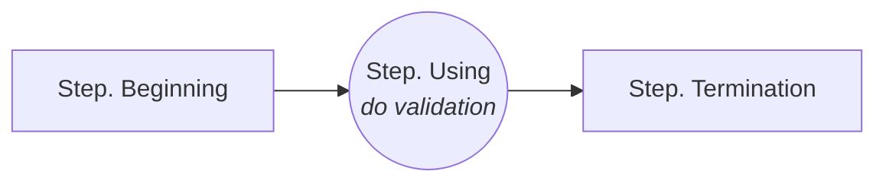
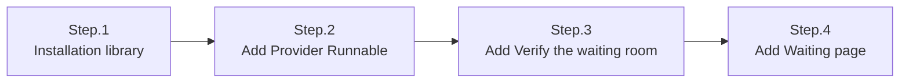

# Usage of Server-side KnownUser SDK for ASP.NET Framework

The *`Server-side KnownUser SDK`* are used to ensure that end users cannot bypass the queue by adding a server-side integration to your web server.
Before getting started please read the documentation to get acquainted with [*Server-side KnownUser SDK*](server-side_knownuser.md).

The recommended method for WEB services is [Using Simple Redirects](#using-simple-redirects).

# Prerequisites
- Server-side KnownUser SDK for ASP.NET Core : you can get the latest released version [here](archive/coat9.knownuser.v1.aspnetcore.zip) and [doc](archive/coat9.knownuser.v1.aspnetcore.doc.pdf).

- .NET Core >= 3.1 

# Basic flow and class for usage
<center></center>

# Implementation

A decryption key is needed to verify that `Token` is correct. Basically, it provides a way to check directly using decryption key(`<secret key>`). 
<br>However, it is recommended to use the `Method(Provider & Runnable)` to respond if the decryption key(`<secret key>`) changes or the *`Waiting Room Server`* shuts down.

# Method: Basic

Basically, it's a way to check directly using the decryption key(`<secret key>`).

key class & method:
```cs
namespace coat9.knownuser;
public class Token
{
    /// <summary>
    /// Do validation of the token string.
    /// </summary>
    /// <param name="domain">Ticket issued domain. If null or empty, do not check.</param>
    /// <param name="vwrid">Ticket issued vwrid (virtual waiting room ID). If null or empty, do not check.</param>
    /// <param name="secretKey">Decryption key string with a length of 24 digits.</param>
    /// <param name="tokenString">Token string.</param>
    /// <param name="appendExpireTime">Extend the set expire time by seconds. If less than 0, no expire time check.</param>
    /// <returns><c>true</c>: valid,<c>false</c>: invalid.</returns>
    /// <seealso cref="setToken(string)"/>
    public static bool doValidation(string domain, string vwrid, string secretKey, long appendExpireTime, string tokenString);
    public static bool doValidation(string domain, string vwrid, string secretKey, string tokenString);
}
```
The reason why the set expiration time is extended in seconds(`appendExpireTime`) is to correct the network delay of the user and the time error between the *`Waiting Room Server`*.


example:
```cs
// Token Validation
bool result = coat9.knownuser.Token.doValidation("<domain>","<vwrid>","<secret key>","<token string>");
```

# Method: Cached Config
Using `<secret key>` every time a token is checked can be cumbersome and error-prone as all `<secret key>` must be modified if `<secret key>` is changed. To improve this, `<secret key>` is stored in `Config` and cached and used.


```cs
coat9.knownuser.Config config =  coat9.knownuser.Config.getCached();
config.setDomain("coat9.com");            // <domain>
config.setSecretKey("0123456789012345");  // <secret key>
config.setAppendExpireTime(60);           // extend the set expire time by seconds.

// do validation of 'token string'
bool result = coat9.knownuser.Token.doValidation("<vwrid>","<token string>");
```

# Method: Provider
To import `<secret key>` from the *`Waiting Room Server`*, the access URL and the `<domain>` and `<openapi key>`(authentication key) of the service are required.
<br>Use *`Microsoft.AspNetCore.Http`* when requesting to *`Waiting Room Server`*. 

key class & method:
```cs
namespace coat9.knownuser;
public class Token
{

    /// <summary>
    /// Do validation of the token string using cached configuration <see cref="Config"/> variables.
    /// </summary>
    /// <param name="vwrid">Ticket issued vwrid (virtual waiting room ID). If null or empty, do not check.</param>
    /// <param name="tokenString">Token string.</param>
    /// <returns><c>true</c>: valid,<c>false</c>: invalid.</returns>
    /// <seealso cref="doValidation(string, string,ref Token)"/>
    public static bool doValidation(string vwrid, string tokenString);
}
```

example:
```cs
coat9.knownuser.Provider provider = coat9.knownuser.Provider.getCached();
coat9.knownuser.Config config =  provider.getConfig();

config.setDomain("coat9.com");                      // <domain>
config.setAppendExpireTime(60);                     // extend the set expire time by seconds.
provider.setAPIUrl("http://demo.coat9.com/openapi");// `Waiting Room Server` url
provider.setAPIKey("<openapi key>");                // <openapi key> : access authentication key

try{
    // get `<secret key>` from `Waiting Room Server`
    provider.refresh();
}catch(coat9.knownuser.InvalidException ex) {
    Console.WriteLine("result:" + ex);
    return;
}

// do validation of 'token string'
bool result = coat9.knownuser.Token.doValidation("<vwrid>","<token string>");
```

# Method: Provider local config file

If the network environment does not allow access to the 'Waiting Room Server', this method is used by storing config-related information in a file on the system.<br>
Please refer to [*Result in Text format*](server-side_knownuser.md#result-in-text-format) for the writing format. However, code/mesg/size is not necessary.

example:
```cs
coat9.knownuser.Provider provider = coat9.knownuser.Provider.getCached();
coat9.knownuser.Config config =  provider.getConfig();

config.setDomain("coat9.com");                      // <domain>
config.setAppendExpireTime(60);                     // extend the set expire time by seconds.
provider.setLocalConfigFile("<file path>");         // local config file.

try{
    // get `<secret key>` from `Waiting Room Server`
    provider.refresh();
}catch(coat9.knownuser.InvalidException ex) {
    Console.WriteLine("result:" + ex);
    return;
}

// do validation of 'token string'
bool result = coat9.knownuser.Token.doValidation("<vwrid>","<token string>");
```


# Method: Provider Runnable
In order to properly use [Method: Provider](#method-provider) in real services, you must periodically request *`Waiting Room Server`* to update `<secret key>`.

## Rules in case of exceptions
- If `Waiting Room Server` is in shutdown state, it is processed valid(bypass).
- User may not have Token when `Waiting Room Server` operates normally after shutdown. It provides a grace time for this and passes valid(bypass).
- When the response information from `Waiting Room Server` is incorrect, it is processed valid(bypass).


# Method: Provider Runnable for app



The example is described as `[Beginning]/[Using]/[Termination]`, but when implemented in practice, each part should be used appropriately.

example:
```cs
/*
 * [Beginning] Add to application beginning.
 */
coat9.knownuser.Provider provider = coat9.knownuser.Provider.getCached();
coat9.knownuser.Config config =  provider.getConfig();

config.setDomain("coat9.com");                      // <domain>
config.setAppendExpireTime(60);                     // extend the set expire time by seconds.
config.setTokenGraceTime(60);                       // grace time for empty token after an error occurs.
provider.setAPIUrl("http://demo.coat9.com/openapi");// `Waiting Room Server` url
provider.setAPIKey("<openapi key>");                // <openapi key> : access authentication key

// getting `<secret key>` from `Waiting Room Server` works in the background(thread).
// sleep for 1000 ms for each operation.
provider.startRunnable(1000);

/*
 * [Using] Add where you need to check.
 */
// do validation of 'token string'.
boolean result = coat9.knownuser.Token.doValidation("<vwrid>","<token string>");

/*
 * [Termination] Add to application termination.
 */
// stop the background (thread).
provider.stopRunnable();
```
---

# Method: Provider Runnable for IIS



## Example development environment
 * .NET Framework 4.6.1
 * [IIS 10](https://learn.microsoft.com/ko-kr/iis/get-started/whats-new-in-iis-10/new-features-introduced-in-iis-10)


## Step.1 Installation library
add `Server-side Known User SDK & WEB` files to the installed IIS's lib.
```ASN.1
<installed ASP.NET Framework webapps path>
  ....
  +── <library path> : Set the path according to your development environment.               
  |      |── coat9.knownuser.v1d.dll- debug: Server-side KnownUser SDK library 
  |      |── coat9.knownuser.v1.dll - release: Server-side KnownUser SDK library   
  │      └── KnownuserWeb.cs        - Server-side KnownUser WEB library
```
Server-side KnownUser WEB library : KnownuserWeb.cs 
- The 'Waiting Room' related API is a collection of necessary methods for easy use in the WEB environment.
- `Server-side KnownUser WEB library` is [here](archive/coat9.knownuser.v1.aspnetcore.web.cs).


## Step.2 Add Provider Runnable 

```cs
using System.Threading;
using System.Threading.Tasks;
public class KnownuserService
{
    private Timer _timer;

    public Task Start()
    {
        // set timer.
        _timer = new Timer(DoWork, null, TimeSpan.Zero, TimeSpan.FromSeconds(3));

        /*
        * [Benning] Add to application beginning.
        */
        coat9.knownuser.Provider provider = coat9.knownuser.Provider.getCached();
        coat9.knownuser.Config config =  provider.getConfig();
        
        config.setDomain("coat9.com");   // <domain>
        config.setAppendExpireTime(60);  // extend the set expire time by seconds.
        config.setTokenGraceTime(60);    // grace time for empty token after an error occurs.

        provider.setAPIUrl("http://demo.coat9.com/openapi");  // `Waiting Room Server` url
        provider.setAPIKey("<openapi key>");  // <openapi key> : access authentication key

        provider.startRunnable();

        return Task.FromResult(0);
    }

    public Task Stop()
    {
        _timer?.Change(Timeout.Infinite, 0);
        return Task.FromResult(0);
    }

    private void DoWork()
    {
        coat9.knownuser.Provider provider = coat9.knownuser.Provider.getCached();
    }

    public void Dispose()
    {
        /*
        * [Termination] Add to application termination.
        */
        coat9.knownuser.Provider provider = coat9.knownuser.Provider.getCached();
        coat9.knownuser.Config config = provider.getConfig();
        provider.stopRunnable();
    }
}
```

add `KnownuserService`(coat9.KnownuserService) to `Global.asax.cs`(deployment descriptor).

```cs
public class Application : System.Web.HttpApplication
{

    protected void Application_Start()
    {
        // regist Singleton service...
        var KnownuserService = new KnownuserService();
        Application["KnownuserService"] = KnownuserService;

        // Other Application_Start code...
    }

    protected void Application_End()
    {
        Application["KnownuserService"] =  null;
    }
}
```

## Step.3 Add Verify the waiting room
Just install `Server-side KnownUser WEB library`.
And add async Task to `Global.asax`
For usage instructions, see [Using Simple Redirects](#using-simple-redirects).

```cs
public class Global : System.Web.HttpApplication
{
    protected void Application_BeginRequest(object sender, EventArgs e)
    {
        var app = (HttpApplication)sender;
        var ctx = app.Context;

        AsyncCallback callback = ar =>
        {
            var ret = (Task<bool>)ar.AsyncState;

            // 비동기 작업 완료 후 실행될 로직
            if (ret.Result)
            {
                // todo...
            }
        };

        // 비동기 작업 시작
        var task = KnownuserWeb.DoValidationAsync(ctx);
        task.ContinueWith(callback, task);
    }
}

public static class KnownuserWeb
{
    public static Task<bool> DoValidationAsync(HttpContext context)
    {
        var tcs = new TaskCompletionSource<bool>();

        // 비동기 작업 수행
        // ...

        // 작업 완료 후 결과를 TaskCompletionSource에 설정
        tcs.SetResult(true); // 예시로 true로 설정

        return tcs.Task;
    }
}
```

## Step.4 Add Waiting page

```ASN.1
<project>
    ├─ Controllers
    ├─ Shared    
    └─ Views       
          ├─ ...                  ← add file: <waiting page>
          └─ Shared 
               ├─ ...       
               └─ Site.Master     ← modify file: <common page>
```

### Add a <waiting page> to display to `end-user`.
> See also: [Usage of Client-side VWR(virtual waiting room) SDK for JavaScript](../client-side/client-side_vwrsdk_js_usage.md)<br/>
> place the files below according to your service environment.<br/>
> please modify and use the `example page`
 - [coat9-adapter.v1.min.js](../client-side/archive/coat9-adapter.v1.min.js) - COAT9WSDK.
 - [coat9-skin.js](../client-side/archive/coat9-skin.js) - example: custom skin-file.
 - [waiting.html](../client-side/archive/waiting.html) - example: waiting page for `HTTP Redirect`.


### Insert code for waiting completion processing.
> Append to `<common page>`, which is called on every request.<br/>
> please modify and use the `source code`.

```JS
    <script>
        function getUrlParams() {
            var params = {};
            window.location.search.replace(/[?&]+([^=&]+)=([^&]*)/gi,
                function (str, key, value) { params[key] = value; });
            return params;
        }
        var oParams = getUrlParams();

        (function (h, o, u, n, d) {
            h = h[d] = h[d] || { q: [], onReady: function (c) { h.q.push(c) }, }
            d = o.createElement(u); d.async = 1; d.src = n; n = o.getElementsByTagName(u)[0]; n.parentNode.insertBefore(d, n)
        })(window, document, 'script', '<install path>/coat9-adapter.js', 'COAT9WSDK')
        COAT9WSDK.onReady(function (ev, ret) {
            COAT9WSDK.init({
                protocol: 'https', server: 'demo.coat9.com', timeout: 5
                , autoComplete: '*:normal'
                , append: { 'alive': oParams.coat9kr, 'vwrid': oParams.coat9ki
                    , 'coat9k': ((oParams && oParams.coat9k) ? decodeURIComponent(oParams.coat9k) : null)
                }
            });
            COAT9WSDK.start();
        });
        window.history.replaceState({}, '', window.location.pathname);
    </script>
```


# Using Simple Redirects
it is a method designed to be convenient to use in general web and provides the `Server-side KnownUser WEB library` library.
You can refer to the `Server-side KnownUser WEB library` library and make it suitable for each service.


## Token follow is:
<center></center>

## Redirect parameter
<center></center>

`URL encode` is equivalent to encodeURIComponent, see [here](https://developer.mozilla.org/en-US/docs/Web/JavaScript/Reference/Global_Objects/encodeURIComponent).


key class & method:
```cs
public class KnownuserWeb {
    /// <summary>
    /// Verification result.
    /// </summary>
    public enum Result
    {
        /// <summary>empty request url: proceed to the stage of processing service logic.</summary> 
        EmptyServicePath = -2,
        /// <summary>invalid config.</summary> 
        Invalid = -1,
        /// <summary>allowed: proceed to the stage of processing service logic.</summary> 
        Allowed = 0,
        /// <summary>redirect required.</summary> 
        Redirect = 1,
        /// <summary>error: prevent retry.</summary> 
        ErrorPreventRetry = 2,
        /// <summary>error: token verification failed.</summary> 
        ErrorValidationToken = 3,
        /// <summary>error: token and request-url do not match.</summary> 
        ErrorMatchPath = 4,
        /// <summary>error: does not match the uaid(user authentication ID) of the token.</summary>
        ErrorMatchUaid = 5
    }

    /// <summary>
    /// Set UID (user id).
    /// If <c>null</c>, don't use it.
    /// UID is used for access control.
    /// </summary>
    /// <param name="uid">User id.</param>
    public void setUID(string uid);

    /// <summary>
    /// Set UAID (user authentication id).
    /// If <c>null</c>, don't use it.
    /// UAID is used for token validation.
    /// </summary>
    /// <param name="uaid">User authentication id.</param>
    public void setUAID(string uaid);

    /// <summary>
    /// <para>`Service Path` usually uses `User Request URI`.</para>
    /// <para>However, when processing services with `body(post) data`, it is difficult to distinguish.</para>
    /// <para>In this case, you can use `body(post) data` to create a distinguishable string and use it as `Service Path`.</para>
    /// <para>If `Fixed Service Path` is not set, `ser Request URI` is used.</para>
    /// </summary>
    /// <param name="servicePath">Service path string.</param>
    public void setFixedServicePath(string servicepath);

    /// <summary>
    /// When creating a 'redirect URL', the path to the `waiting page URL` is specified without using the value set in the system.
    /// </summary>
    /// <param name="waitingUrl">Waiting page URL.</param>
    public void setFixedWaitingURL(string waitinguRL);

    /// <summary>
    /// The path 'Error Page URL' specifies.
    /// </summary>
    /// <param name="errorUrl">Error Page URL.</param>
    public void setErrorURL(string eurl);

    /// <summary>
    /// Gets the verification result of the `Token`.
    /// </summary>
    /// <returns>Verification result of the `Token`.</returns>
    public coat9.knownuser.TokenVerify getTokenVerify();

    /// <summary>
    /// Get the redirect URL string.
    /// </summary>
    /// <returns>The redirect URL string.</returns>
    public string RedirectURL();

    /// <summary>
    /// do validation.
    /// </summary>
    /// <returns>Validation result.</returns>
    public Result doValidation();

    /// <summary>
    /// Sample: do HTTP redirect.
    /// </summary>
    /// <param name="context">  HttpContext.</param>
    /// <param name="url">redirect URL string.</param>
    /// <remarks>
    /// ----------------------------------------------------------------------
    /// This method developer must adjust it to suit the service environment.
    /// ----------------------------------------------------------------------
    /// </remarks>
    public static void doSampleRedirect(HttpContext context, String url);

    /// <summary>
    /// Sample: Adds a message to the error page URL for HTTP Redirect.
    ///         format: <error url> + [?|&]errno=x + &emesg=..
    /// </summary>
    /// <param name="context">HttpContext.</param>
    /// <param name="knownuser">coat9's web library.</param>
    /// <param name="eno">Error number.
    /// -1: Invalid config.
    ///  2: Prevent retry.
    ///  3: Validation token.
    ///  4: Does not match the path of the token.
    ///  5: Does not match the uaid(user authentication ID) of the token.</param>
    /// <param name="mesg">Error message string.</param>
    /// <seealso cref="doSampleRedirect(HttpContext, String)"/>
    /// <remarks>
    /// ----------------------------------------------------------------------
    /// This method developer must adjust it to suit the service environment.
    /// ----------------------------------------------------------------------
    /// </remarks>
    public static void doSampleErrorMessage(HttpContext context, KnownuserWeb knownuser, int errno, String mesg);

    /// <summary>
    /// Sample: Performs validation.
    ///         depending on the result, if waiting is necessary, `HTTP Redirect` is performed to the `waiting page`,
    ///         and if an error occurs, `HTTP Redirect` is performed to the `error page`.
    /// </summary>
    /// <param name="context">HTTP Servlet Response.</param>
    /// <returns>True - allow us to provide services. False - Result was processed with `HTTP Redirect`.</returns>
    /// <seealso cref="coat9.test.web#doValidation()"/>
    /// <seealso cref="doSampleRedirect(HttpContext, String)"/>
    /// <seealso cref="doSampleErrorMessage(HttpContext, KnownuserWeb, int, String)"/>
    /// <remarks>
    /// ----------------------------------------------------------------------
    /// This method developer must adjust it to suit the service environment.
    /// ----------------------------------------------------------------------
    /// </remarks>
    public static bool doSampleValidation(HttpContext context);

    /// <summary>
    /// Check if it is the ‘Path’ where you want to perform ‘Validation’.
    /// </summary>
    /// <param name="context">file path string.</param>
    /// <returns><c>True<c>bypass <c>False</c> do validation.</returns>
    /// <remarks>
    /// ----------------------------------------------------------------------
    /// This method developer must adjust it to suit the service environment.
    /// ----------------------------------------------------------------------
    /// </remarks>
    public static bool isSamplePathToBypass(string path);

    /// <summary>
    /// Verify the ‘waiting room’.
    /// </summary>
    /// <param name="context">HTTP Servlet Response.</param>
    /// <returns><c>True<c>bypass <c>False</c> do validation.</returns>
    /// <remarks>
    /// ----------------------------------------------------------------------
    /// This method developer must adjust it to suit the service environment.
    /// ----------------------------------------------------------------------
    /// </remarks>
    public static async Task<bool> doValidation(HttpContext context);
}
```

Setting `Token` verification conditions : TokenVerify
```cs
public class TokenVerify {
    /// <summary>
    /// Set whether to verify the vwrid included in <see cref="Token"/>.
    /// </summary>
    /// <param name="vwrid"><c>true</c>: enable, <c>false</c>: disable.</param>
    public void setVwrid(bool vwrid);

    /// <summary>
    /// Set whether to verify the expire-time included in <see cref="Token"/>.
    /// </summary>
    /// <param name="expiretime"><c>true</c>: enable, <c>false</c>: disable.</param>
    public void setExpireTime(bool expiretime);

    /// <summary>
    /// Limits the usage time of the issued <see cref="Token"/>.
    /// If the specified limit time is less than 0, it is not verified.
    /// </summary>
    /// <param name="limit_time">The limit usage time.</param>
    public void setLimitUsagetime(long limit_time);
    
    /// <summary>
    /// Limits the usage time of the <see cref="Token"/> allowed for the service.
    /// If the specified limit allowed time is less than 0, it is not verified.
    /// </summary>
    /// <param name="limit_time">The limit allowed time.</param>
    public void setLimitAllowedtime(long limit_time);
    
    /// <summary>
    /// Set whether to verify the service-path included in <see cref="Token"/>.
    /// </summary>
    /// <param name="servicepath"><c>true</c>: enable, <c>false</c>: disable.</param>
    public void setServicePath(bool servicepath);
}
```

Modify the `methods` below in `KnownuserWeb` to suit your service.
- doSampleRedirect()
- doSampleErrorMessage()
- doSampleValidation()
- isSamplePathToBypass()

>In the `KnownuserWeb`, `context.Session.Id` was used as `uaid`. `uaid` can be any string that can identify the user. If you do not want to distinguish `uaid`, you can treat it as null.<br/>
>If an `error` occurs, processing such as `Redirection` to `error page` or displaying a message is necessary.
>
> `RedirectURL` ($KnownuserRedirectURL) is managed by Admin.<br/>
> `RedirectURL` must have already been created, please refer to [`Client-side SDK`](./../client-side/client-side_vwrsdk.md).

# License

The code in this repository is licensed under the [COAT9 License](./../LICENSE.md). Where available, coat9vwr places the associated license(s) in the location `installed`.
